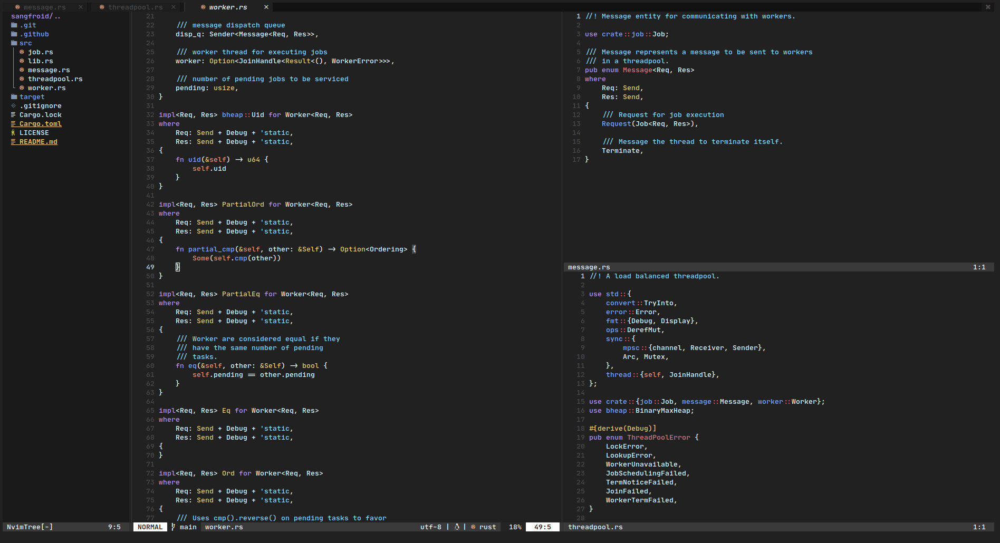

# `~/.config/nvim`

Lua based config for nvim.

## Directory structure

```text
.
├── init.lua                # entrypoint -> require("core")
├── lua
│   ├── core                # base editor setup + startup wiring
│   │   ├── init.lua
│   │   ├── options.lua
│   │   ├── keymaps.lua
│   │   └── autocmds.lua
│   ├── config              # plugin/feature configuration modules
│   │   ├── lazy.lua
│   │   ├── lsp
│   │   │   ├── init.lua
│   │   │   ├── config.lua
│   │   │   ├── handlers.lua
│   │   │   └── settings
│   │   └── ...
│   ├── plugins             # lazy.nvim plugin specs (domain-wise)
│   │   ├── core.lua
│   │   ├── ui.lua
│   │   ├── editor.lua
│   │   ├── completion.lua
│   │   ├── lsp.lua
│   │   ├── dap.lua
│   │   └── telescope.lua
│   └── common              # shared helpers (reserved for future use)
└── assets
```

Startup flow:
1. `init.lua` loads `core/init.lua`
2. `core/init.lua` loads editor core + `config/lazy.lua`
3. `config/lazy.lua` imports plugin specs from `lua/plugins`
4. feature configs are loaded from `lua/config`



## Installation
Clone this repository to `~/.config/nvim`. Make sure to backup any existing nvim config dir.

```
mv ~/.config/nvim ~/.config/nvim.old  # move existing nvim config dir
git clone https://github.com/arindas/nvim-config.git ~/.config/nvim
```

Alternatively, you can clone this repository to some other path and keep a symlink. e.g.:
```
git clone https://github.com/arindas/nvim-config.git $HOME/source/nvim-config
ln -s ~/.config/nvim $HOME/source/nvim-config
```


## Check nvim health
Open nvim and use the following command:
```
:checkhealth
```

## Dependencies
Python and node support for nvim. (node is optional)
- nvim python support
  ```
  pip install pynvim
  ```

- neovim node support
  ```
  npm i -g neovim
  ```

## Reference
- [https://github.com/LunarVim/Neovim-from-scratch](https://github.com/LunarVim/Neovim-from-scratch)
